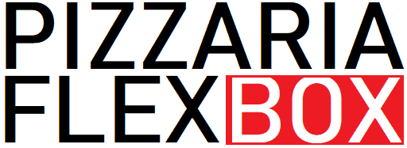

<h1 align="center">Pizzaria Flexbox</h1>

    

 Site de uma Pizzaria criado para eu praticar meus estudos recentes de Flexbox. Acesse o projeto clicando <a href="https://brunosabbagmachado.github.io/pizzaria-Flexbox/">aqui</a>.

    

    

# Tabela de conteúdos

<!--ts-->
- [Sobre](#Sobre)
- [Projeto](#O-Projeto)
- [Imagens](#Imagens)
- [Conclusão](#Conclusão)
- [Sobre mim](#Sobre-mim)
<!--te-->

# Sobre

Criei uma página para ssa pizzaria que inventei, a Pizzaria Flexbox, com o intúito de praticar meus recentes estudos sobre o contéudo de Flexbox.

A ideia do projeto surgiu após eu terminar o [curso](https://cursos.alura.com.br/course/posicione-elementos-com-flexbox) na Alura, onde aprendemos a fazer uma mni página da plataforma de cursos usando as ferramentas do Flexbox.

# O Projeto

Esse site possuí apenas uma página, com links não redirecionaveis, pois meu foco era entender e descobrir mais sobre as ferramentas do Flexbox.

O design foi baseado no site da [PizzaHut](https://www.pizzahut.com.br/order/pizzas). O formato de apresentação dos sabores, assim como os valores e descrições, foram baseados no app da pizzaria [Biazzini](https://play.google.com/store/apps/details?id=com.wabiz.delivery.biazzini&hl=pt_BR&gl=US).

O mais interessante de criar esse site foi perceber como o Flexbox facilita muito a configuração. No meu projeto anterior, do [Homem Aranha](https://github.com/brunosabbagmachado/spiderman-Fan-Page), eu criei os cards dos aranhas mas sem entender sobre Flex. Com certeza teria sido muito mais fácil de faze-los.

# Imagens

<h2 align="center">Computador</h2>

    

<h2 align="center">Celular</h2>

    

# Conclusão

O projeto é simples mas creio que atingi meu objetivo de aprender a usar o Flexbox e suas propriedades. Consegui criar um site com um bom design e que é responsivo. 

O projeto foi concluído em torno de uma semana.

O próximo passo é aprender CSS Grid.

# Sobre mim

Oi, eu sou o Bruno e é uma honra ter você aqui.

Espero que tenha gostado do projeto. Fique a vontade para comentar, ou até melhorar o código. Será um prazer compartilhar conhecimentos.

Me siga aqui no [Github](https://github.com/brunosabbagmachado) e também no [Linkedin](https://www.linkedin.com/in/brunosabbagmachado/). Vou te seguir de volta e será uma horna ter você na minha rede.

Abraços

